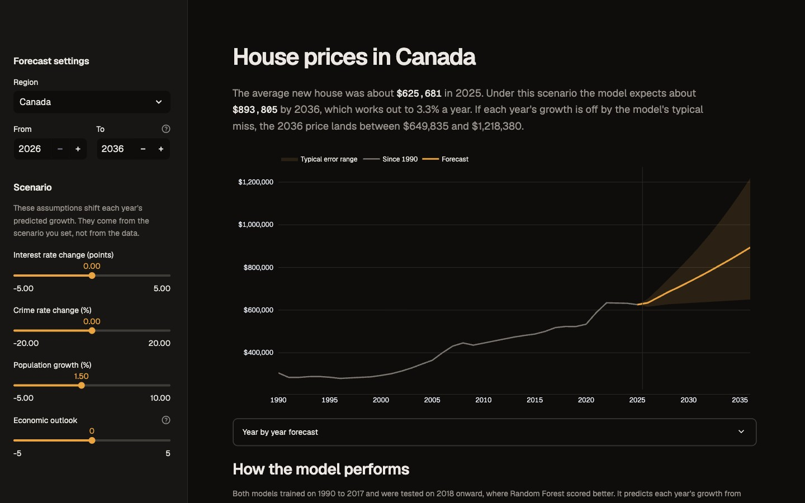
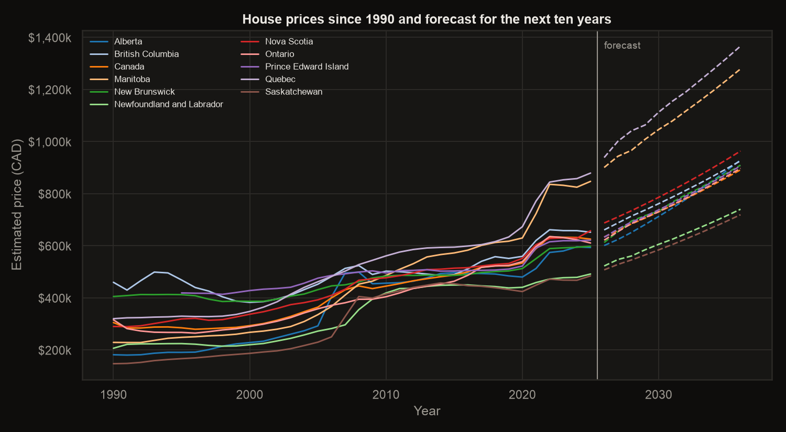
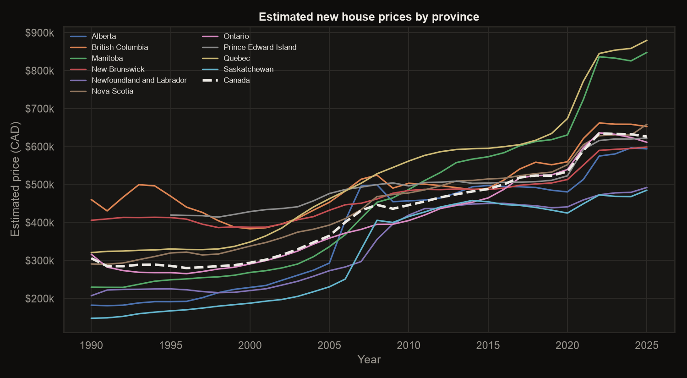
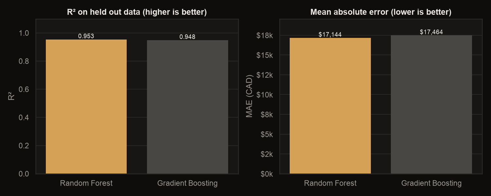
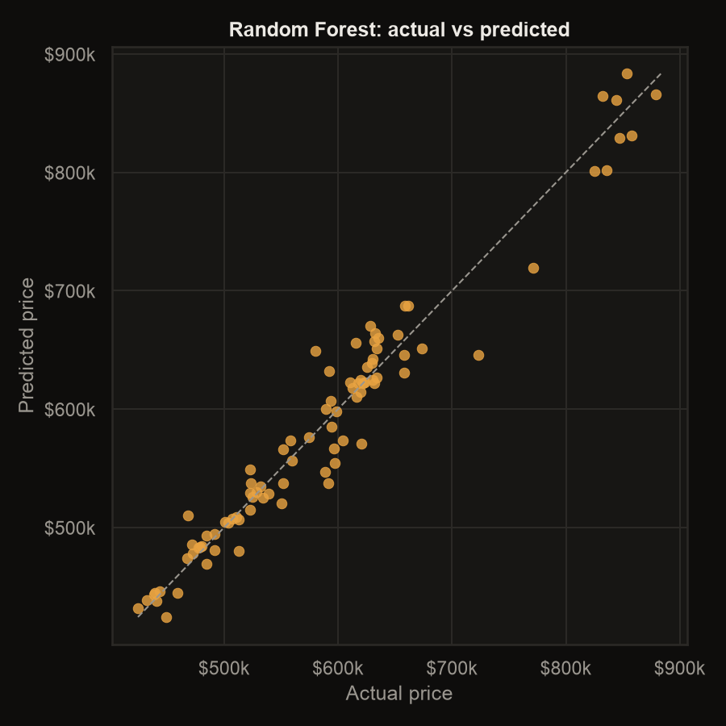
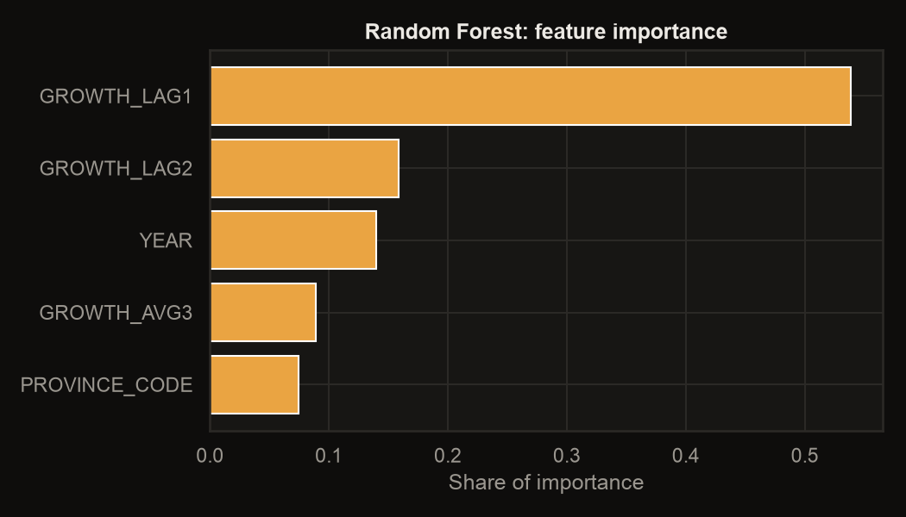

# Canadian property predictor

A machine learning model that forecasts average new house prices for Canada and each province, with a Streamlit app that projects prices from 2026 to any year up to 2100 under different economic scenarios.



## How it works

`model.py` reads the Statistics Canada new housing price index, converts it into estimated prices in Canadian dollars and keeps every year from 1990 to 2025. Instead of predicting a price directly, the models predict each year's growth from the previous years' growth, the region and the year. Forecasts then compound those predictions year by year from each region's latest price, which lets them run well past the range the models were trained on.

Two models were trained on 1990 to 2017 and tested on 2018 to 2025, so the test years are ones the models never saw:

| Model | R² (one year ahead price) | Mean absolute error | Growth error |
|---|---|---|---|
| **Random Forest** (selected) | **0.953** | **$17,144** | **2.95 points** |
| Gradient Boosting | 0.948 | $17,464 | 3.04 points |

The Random Forest scored better, so it was refit on all years from 1990 to 2025 and saved. Its forecast for Canada is about $634,000 in 2026 and $863,000 by 2035, which is roughly 3.5% growth a year. Forecasts further out compound the same way and become less certain the further they go.

`app.py` loads the saved model and shows prices since 1990 next to the forecast, with a shaded range for the model's typical yearly error. Pick a region in the sidebar, choose any range from 2026 to 2100 (ten years by default) and adjust interest rates, crime, population growth and the economic outlook to shift each year's growth. The chart and summary update as you change settings, and a "How the model performs" section draws the evaluation charts live. The app uses the same dark palette and Geist type as [hashimjama.dev](https://hashimjama.dev).



## Charts

`charts.py` builds every chart with Matplotlib and Seaborn. Training saves them to `figures/` and the app renders the same functions live.





| Actual vs predicted (2018 to 2025) | Feature importance |
|---|---|
|  |  |

## Run it

```bash
python -m venv .venv && source .venv/bin/activate
pip install -r requirements.txt
streamlit run app.py
```

To retrain, run `python model.py`. It compares both models on the recent test years, refits the better one on all data, saves it as `housing_model_*.joblib` (which the app picks up automatically) and redraws the charts in `figures/`.

## Data

All tables in `tables/` come from Statistics Canada and are used under the [Open Government Licence – Canada](https://open.canada.ca/en/open-government-licence-canada):

- New housing price index (`housingvalueinindex.csv`)
- Crime severity index (`crime.csv`)
- Population estimates (`population.csv`)
- Farm land and building values (`landvalue.csv`)

The financial market statistics table (`interest.csv`, about 95 MB) is left out of this repository because training doesn't read it. Download it from Statistics Canada's financial market statistics table if you want the full data survey that `model.py` prints.
